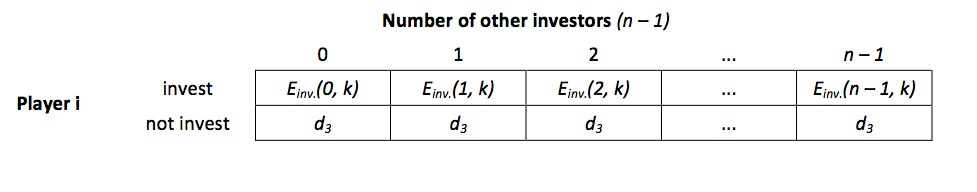
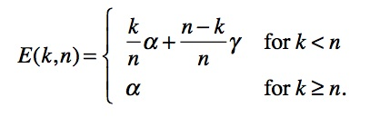
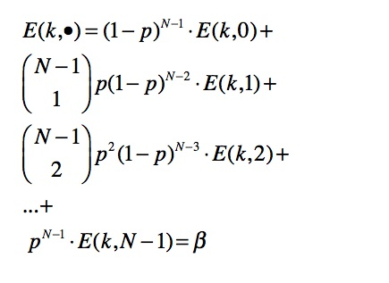

# MATLAB HS13 – Research Plan

> * Group Name: TocquevilleParadox
> * Group participants names: Joël Berger, Milan Bombsch, Zhonghuan Dai
> * Project Title: Boudon Competition Model

## General Introduction
According to the historian Alexis de Tocqueville, before the French Revolution, economic and social conditions improved significantly. As a result, paradoxically, the frustration grew among the French. Consequently, the Revolution broke out. Due to this observation, the phenomenon that in a social system aggregate frustration can diffuse when conditions improve is called "Tocqueville's paradox" (Neckel 2010). 

Tocqueville's paradox has been reporter in several empirical studies (e.g. Stouffer et al. 1965, Peirò et al. 2010) and it is important to know under which circumstance improving conditions fuel frustration rather than satisfaction. Usually it is costly for a social entity - be it an organization or a society - to provide further chances, let's say, for upward mobility. When improvements lead to less satisfaction, obviously, resources have been waisted (Raub 1984).

Although many explanations of Tocqueville's paradox have been proposed, the game theoretic model by the French sociologist Raymond Boudon (1979) provides the most elaborated one (Raub 1984). Nevertheless, the model is based on restrictive assumptions and it seems worthwhile to relax some of them in order to make the model more realistic.

## The Model

In a social system, each of N players decides whether or not to invest resources such as time, money or effort, in a competition for a scarce and highly valued good, e.g. a high prestige position within a firm. Should there be more investors than positions k, some competitors will invest in vain. In other words: The higher the number of competitors n, the smaller the expected value of the strategy "invest" gets (see Figure 1: Game matrix form perspective of any player I for a given number of positions k).

Given the position is valuable enough, a small increase in the chances of obtaining this good (e.g. one additional high prestige positions in a firm) can tempt a disproportionate number of players to invest. As a result, there are more additional frustrated losers than additional satisfied winners and on the aggregate level and dissatisfaction increases.

The parameters of the models are the number of players N, the number of scarce positions k, and the payoffs for successful investors (alpha), frustrated losers (gamma) and non-investors (beta). It must hold that alpha > beta > gamma. 

For a given parameter constellation (alpha, beta, gamma, k, N), each actor decides whether or not to invest the following way: Our focal player calculates the expected payoff for each possible number of investors as described in equation 1: 

Should the expected payoff for the strategy "invest", given a number of other investors E(k, n), be greater than the payoff for the strategy "not invest", independently of the number of investors n, she will invest with certainty (dominant strategy). Should there be no dominant strategy, our focal player calculates the overall expected payoff of the strategy invest E(k, .). Then, the overall expected value of"invest" its equated with beta, the payoff of the strategy "not invest". Forth, equation 2 is solved for p. This yields investment probability p*. If everyone invests with p*, this results in a Nash equilibrium in mixed strategies.

The proportion of investors equals p* (or 100% in case of a dominant strategy). The proportion of losers equals the proportion of investors minus the proportion of winners. The proportion of winners equals the number of positions k/N.

## Fundamental Questions

Tocqueville's paradox is derived from restrictive model assumptions such as homogeneous and totally rational actors. In order to approximate social reality more closely, it seems worthwhile to extend the model. We will do this by introducing 3 classes (1). Middle class individuals will invest rationally, while upper class individuals invest with a slightly higher than the optimal probability and under class individuals with a lower than optimal probability. This mimics the finding from social stratification research, that given the same qualifications, upper class individuals rather invest in higher education than lower class individuals (e.g. Becker and Lauterbach 2007).  Moreover, we implement a feedback mechanisms into the model (2). Starting with a homogeneous population, the winners of the competition join the upper class while the losers join the underclass. Starting from a homogeneous population, the model can be iterated in order to observe the emergence of different classes and how different stratification regimes influence the occurrence of Tocquevilles paradox.

## Expected Results

We do not really know in which way our alterations might change the outcome since our model extensions are new. Nevertheless, since the model is closer to reality when introducing heterogeneous actors and we model a process instead of only a state, it is worthwhile to implement the model this way all the same.

## References 

Becker ,R, Lauterbach, W (2007). Bildung als Privileg. Ursachen, Mechanismen, Prozesse und Wirkungen. Wiesbaden: VS.

Boudon, R (1982) The Unintended Consequences of Social Action. London: Macmillan.

Neckel, S (2010): Verbesserungen führen zum Umsturz. Alexis de Tocqueville: “Der alte Staat und die Revolution”—das Tocqueville Paradox. In Sternstunden der Soziologie: Wegweisende Theoriemodelle des soziologischen Denkens, eds. Neckel S. et al., 381–386. Campus.

Stouffer SA, Suchman EA, Vinney LC de, Star SA, Williams RM Jr. (1965) The American Soldier. Manhattan (Kansas) Military Affairs; Aerospace Historian Publishing.

Tocqueville, A (1952 [1856]) L’Ancien Régime et la Révolution. Paris: Editions Gallimard.

## Research Methods
Game Theory and Agent Based Model

## Other

No empirical data is necessary for this project since it is a purely theoretical simulation.

