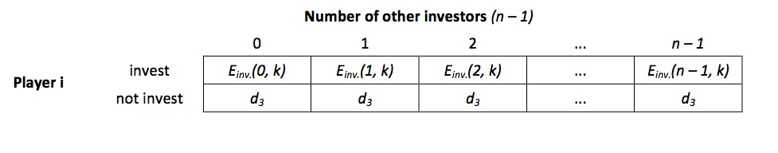

# MATLAB HS13 – Research Plan

> * Group Name: TocquevilleParadox
> * Group participants names: Joël Berger, Milan Bombsch, Zhonghuan Dai
> * Project Title: Boudon Competition Model

## General Introduction
According to the historian Alexis de Tocqueville, before the French Revolution, economic and social conditions improved significantly. As a result, paradoxically, the frustration grew among the French. Consequently, the Revolution broke out. Due to this observation, the phenomenon that in a social system aggregate frustration can diffuse when conditions improve is called "Tocqueville's paradox" (Neckel 2010). 

Tocqueville's paradox has been reporter in several empirical studies (e.g. Stouffer et al. 1965, Peirò et al. 2010) and it is important to know under which circumstance improving conditions fuel frustration rather than satisfaction. Usually it is costly for a social entity - be it an organization or a society - to provide further chances, let's say, for upward mobility. When improvements lead to less satisfaction, obviously, resources have been waisted (Raub 1984).

Although many explanations of Tocqueville's paradox have been proposed, the game theoretic model by the French sociologist Raymond Boudon (1979) provides the most elaborated one (Raub 1984). Nevertheless, the model is based on restrictive assumptions and it seems worthwhile to relax some of them in order to make the model more realistic.

## The Model

In a social system, each of N players decides whether or not to invest resources such as time, money or effort, in a competition for a scarce and highly valued good, e.g. a high prestige position within a firm. Should there be more investors than positions k, some competitors will invest in vain. In other words: The higher the number of competitors n, the smaller the expected value of the strategy "invest" gets (see Figure 1: Game matrix form perspective of any player I for a given number of positions k).

## Fundamental Questions
Tocqueville's paradox is derived from restrictive model assumptions such as homogeneous and totally rational actors. Should the model not just provide an idealized mechanism of how Tocqueville's paradox is brought about, but also a realistic explanation, it must be demonstrated that the model generates the paradox under less restrictive assumptions. For instance, in the real world, actors differ in their risk-preferences or their endowment of resources. Moreover, they are not perfectly informed about the chances of succeeding in a competition and their beliefs about this might be formed by information obtained through networks. Hence, the model might be extended by one ore more of these factors (heterogeneous actors, resources, belief-formation through networks). In doing so, one could describe the effect of one of these variables on the occurrence of Tocqueville's paradox.
In our project we would like to relax the perfect infromation assumtion, and try out different ways how actors update their believes. The question is how these differences in believe formation changes the model predictions.

## Expected Results
Varying individual properties will lead to an increase in the variation of possible model outcomes. For instance, if some actors have more pessimistic beliefs about chances of willing or have to take higher costs for investing, they will invest with a lower probability. Consequently, the number of losers will not increase as dramatically as under standard assumptions. Thus, the conditions under which the model generates Tocqueville's paradox will be less general. This implies however, that besides a more realistic explanation, more precise predictions about the occurrence of the target phenomenon can be made. 

## References 
Berger, J, Diekmann A (2013) The Logic of Relative Frustration. Boudon's Competition Model and Experimental Evidence. Working Paper, ETH Zurich.

Boudon, R (1982) The Unintended Consequences of Social Action. London: Macmillan.

Raub W (1984) Rationale Akteure, institutionelle Regelungen und Interdependenzen. Untersuchungen zu einer erklärenden Soziologie auf strukturell-individualistischer Grundlage. Frankfurt/Main; New York; Nancy: Peter Lang.

Tocqueville, A (1952 [1856]) L’Ancien Régime et la Révolution. Paris: Editions Gallimard.

## Research Methods
Game Theory and Agent Based Model

## Other
In principle, no data is necessary for this project since it is a purely theoretical simulation. Nevertheless, empirically measured risk preferences could be used as an alternative to the standard assumption of risk neutral preferences.
